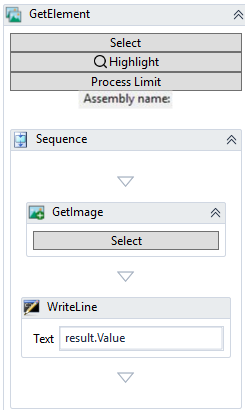
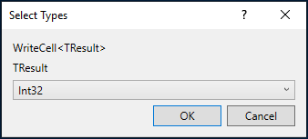
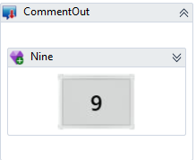

# OpenApplication

**What:** The basic idea behind this activity, is to make it easy to check for a running application, and launch it, if it is not. At the time of writing this, the activity supports Windows components, Internet Explorer and NativeMessaging (chrome/Firefox)

**How:** Click any running application/webpage and a selector for that application will be created. To fine tune, click Open Selector and make your modifications (like what elements to look for) To test the selector is working, click Highlight

**Why:** Use it instead of clicking though the start menu or opening files directly. The selector will include details like parameters, so if you opened word by clicking a document, the selector will detect that too.

# CloseApplication

**What:** Close an application or webpage

**How:** Click any running application/webpage and a selector for that application will be created. To fine tune, click Open Selector and make your modifications (like what elements to look for) To test the selector is working, click Highlight

**Why:** Use it instead of clicking the close button. Can be handy if the application some times hangs, or you just want an efficient way of forcing an application to close.

# HighlightElement

**What:** Highlights a found element.

**How:** Drag this inside a GetElement activity, to highlight it. The workflow will continue while highlighting, to block the workflow from running while highlighting, set Clicking=True

**Why:** Use for debugging, or use it to make nice effects while the robot is running.

# TypeText

**What:** To assign a value you generally should use the Value property on item's, but if you need to send a Key combination to an application, this is your friend. 

**How:** I strongly recommend using the Record function to use this, but in case your interested in understanding the syntax, you can [read more here](typetext-syntax.md).

**Why:** Sometimes its just easier/faster to use a short cut key, or if the element will not receive the input properly.

# ClickElement

**What:** Represents a mouse click, the default is using virtual clicks. This means different things depending on the object type and provider, but generally you can think if it as a click without moving the mouse. Set VirtualClick to False, to do a real Mouse Click and then use OffsetX/OffsetY to make the click hit within the element (0,0 will be the top left corner of the element)

**How:** I strongly recommend using the Record function to use this, but if you drag this inside an GetElement activity remember to set the Element property to item.

**Why:** Clicking is needed, not everything can be done using shortcut keys.

# GetElement

**What:** The primary tool of the robot, used for locating items in the environment. Depending on the provider the settings may differ, but generally this can be used to locate one or many elements based on a selector. Use Open Selector to fine tune what you want. Per default, we will only find 1 item, and throw an error if we find less than one object. Use MaxResults and MinResults to change this behaviour. 
For instance if you want to loop though a DataSet you could select the DataRow and set MaxResults to 100. Then within the GetElement you add new GetElement to "pick" different elements per DataRow.
Setting MinResults to 0, effectively means your only checking if an object exists, but is not throwing an error, if nothing is found

**How:** Either press Record and click an element, the robot will try and figure out what type of element you clicked and insert the appropriate GetElement activity, or you can drag one in your self and use Open Selector to precisely select the element your interested in.

**Why:** Without elements, it's not really RPA 

# GetImage

**What:** Get an image relative to another element.

**How:** Place GetImage inside an GetElement, and select a placement to grab, relative to the objects found.

**Why:** Image you want to ready the assembly name, using images, you open properties on the project find the label for the field, and then in GetImage select the field with the value. Now you can easily grab the value using OCR ( .Value will use OpenCV OCR)

# Detector

**What:** Make workflow wait for an detector to be triggered

**How:** Drag it onto your workflow, and select a detector from the dropdown menu. When the workflow is running, when it gets to this activity the workflow will go idle and wait until the selected detector gets triggered. ( state is saved, so if the robot or the machine is rebooted, the workflow will continue from this activity )

**Why:** This is an excellent way to make a workflow react to things in the environment. You could make a workflow that helps filling in information into a form when the user presses a specific keyboard combination, or you would show a helpful dialog, when ever a user opens a Timesheet, or maybe you want to add extra actions to an existing button. 

Note, as soon as an activity has been created, all actions will also be sent to OpenFlow.
You can use OpenFlow to trigger other robots based on a trigger ( or interact with one of the more than 2000 different systems supported )

# InvokeOpenFlow

**What:** Call a workflow inside OpenFlow

**How:** Insert a workflow node inside OpenFlow, check RPA to make it visible to robots and click deploy. Now you can select this workflow inside the InvokeOpenFlow activity inside OpenRPA. All variables in the workflow will be sent to the workflow in msg.payload, and any data in msg.payload will be sent back to the robot once completed, if a corresponding variable exists.

**Why:** Greatly improves to possibilities in RPA workflow, by giving access to other robors and more than 2000 other systems, using an easy to use drag and drop workflow engine.

# InvokeOpenRPA

**What:** Call other workflow in OpenRPA

**How:** Drag in InvokeOpenRPA and select the workflow you would like to call. Any arguments in the targeted workflow will be mapped to local variables of the same name, to support transferring parameters between the two workflows. Click "Add variable" to have all the in and out arguments in the targeted workflow created locally in the current scope/sequence.

Why: More complex workflows is easier to manage if split up to smaller "chucks" that call each other. Having multiple smaller workflows also give easy access to run statistics on each part of the workflow using OpenFlow.

# ReadCell

**What:** Read a single cell in an excel spreadsheet. Type of data is selected in the ArgumentType dropdown list.

**How:** Can be added doing recording by pressed esc when clicking inside excel or manually dragged into a workflow. Select the type of data your reading, select the cell to read from in the Cell property for instance "A2" and set the receiving variable in the Result property. To force excel to read from the correct Sheet, also set the worksheet property.

**Why:** Classical RPA technologies can have a hard time working with application that does a lot of UI manipulation doing run time, such as Microsoft Excel, so using Office COM interfaces is more convenient. It also offers more options, like reading the formula or the value etc.

# WriteCell

**What:** Write a value into an excel spreadsheet. Type of data is selected in the ArgumentType dropdown list.

**How:** Can be added doing recording by typing a value in the input dialog when clicking inside excel or manually dragged into a workflow. Select the type of data your reading, select the cell to write in too the Cell property for instance "A2" and set the value/variable in the Value property. To force excel to read from the correct Sheet, also set the worksheet property. Use Formula if you want excel to calculate the field instead of just adding the value.

**Why:** Classical RPA technologies can have a hard time working with application that does a lot of UI manipulation doing run time, such as Microsoft Excel, so using Office COM interfaces is more convenient. It also offers more options, like reading the formula or the value etc.

# ReadRange

**What:** Read several cell or a whole sheet into a DataTable. Can also be used to easily find next empty cell using LastUsedColumn and LastUsedRow

**How:** Drag a ReadRange in and select the spreadsheet to open. To force a specific sheet, fill in Worksheet property. Set the range to read in Cells property and the receiving property in "DataTable" property

**Why:** Classical RPA technologies can have a hard time working with application that does a lot of UI manipulation doing run time, such as Microsoft Excel, so using Office COM interfaces is more convenient. It also offers more options, like reading the formula or the value etc.

# CommentOut

**What: **Comment out, lets you easily remove parts of a workflow. Anything you place inside CommentOut will not be executed.

**How:** Simply drag'n'drop or copy'n'paste activities into this activity. A right click option will soon be implemented for even faster adding and removing out commented code.

**Why:** While debugging it can be handy to remove small parts of an workflow, sometimes people also use it for template's.

# CopyClipboard

**What:** Copy what ever is in the clipboard, set SendCtrlC to true, to grab what ever is selected right now

**How:** After copying or marking text or an image, insert this activity and you get the result in StringResult or ImageResult

**Why:** Sometimes its just more convenient to use copy'n'paste, other times is the best way for instance when automating using Remote Desktop or Citrix, using OCR is not always reliable, so using copy'n'paste is better

# InsertClipboard

**What:** Adds text to the clipboard, ready to be pasted.

**How:** Just assign text to the Text Property.

**Why:** I don't know why, it just felt right, after creating CopyClipboard. Maybe you want to add a text, the user can then decide where to insert. 

# OpenURL

**What:** It is pretty much the same as OpenApplication, except it only supports Internet Explorer. 

**How:** Click Get current, to automatically fetch the URL of the active tab of first browser it finds.

**Why:** Not sure, OpenApplication should be good enough for now.

