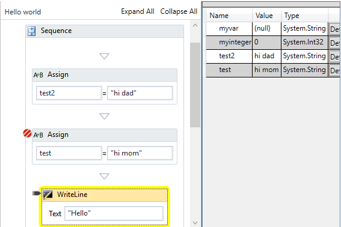
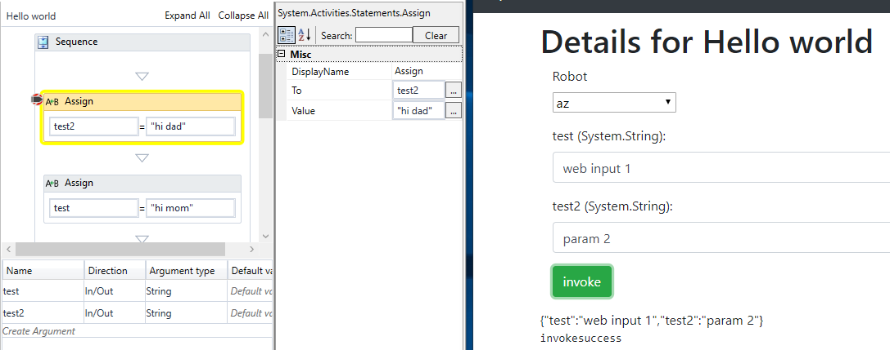

## WriteLine

A common way of debugging is printing out the content of different variable with information about where in the workflow this happened

That is perfectly good way of keeping an eye on how a workflow is performing and making sure everything is working as expected. But once in a while when you are hunting down a specific problem, or if you unsure how to get specific information it can be handy to use breakpoints instead.

## Breakpoints

Select any activity in a workflow and press F9. This will toggle a break point at the given location, show with the little red icon in the top left corner.

When a workflow is running at gets to an activity with a breakpoint enabled, it will stop execution and "dump" all variable and parameters for the workflow in the inspection window. You will know where the workflow halted, but the yellow border around the activity

Notice that test is (null) and does not contain the value "hi mom". We need to let the workflow execute one more activity in order for this to happen, you do that by pressing the step over key F10.

Now test contains "hi mom" and the yellow border has moved to the next activity.

You do not need to single step over every activity, by pressing F5 ( or the Play button ) the workflow will continue as normal, and/or stop next time it hits a breakpoint. You can add and remove breakpoints even when the workflow is running or is idle.

Breakpoints also work, when workflows have been started remotely from OpenFlow, making debugging parameters from OpenFlow very easy.

